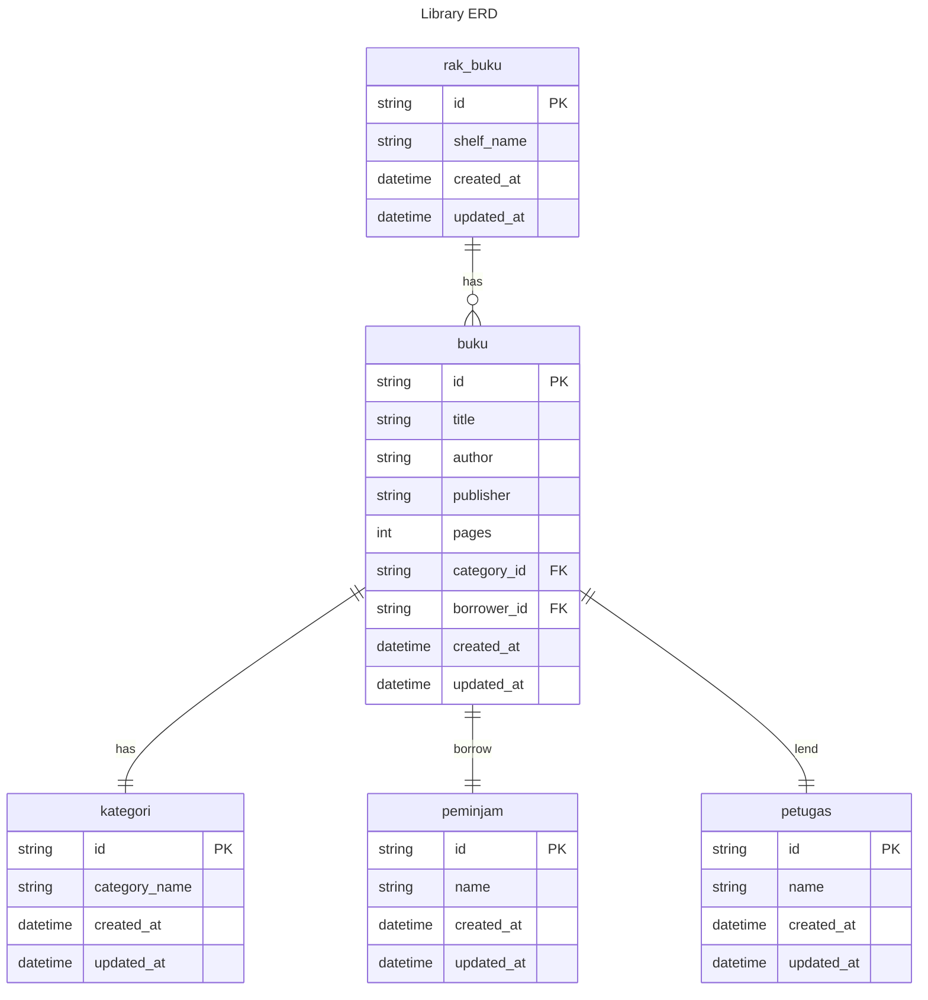

# Entity Relationship Diagram : Library ERD

```mermaid
---
    title: Library ERD
---
    erDiagram

    buku {
        string id PK
        string title
        string author
        string publisher
        int pages
        string category_id FK
        string borrower_id FK
        datetime created_at
        datetime updated_at
    }

    kategori {
        string id PK
        string category_name
        datetime created_at
        datetime updated_at
    }

    rak_buku {
        string id PK
        string shelf_name
        datetime created_at
        datetime updated_at
    }

    petugas{
        string id PK
        string name
        datetime created_at
        datetime updated_at
    }
    
    peminjam{
        string id PK
        string name
        datetime created_at
        datetime updated_at
    }

    buku ||--|| kategori : has
    rak_buku only one to zero or many buku : has
    buku only one to only one peminjam : borrow
    buku only one to only one petugas : lend
```