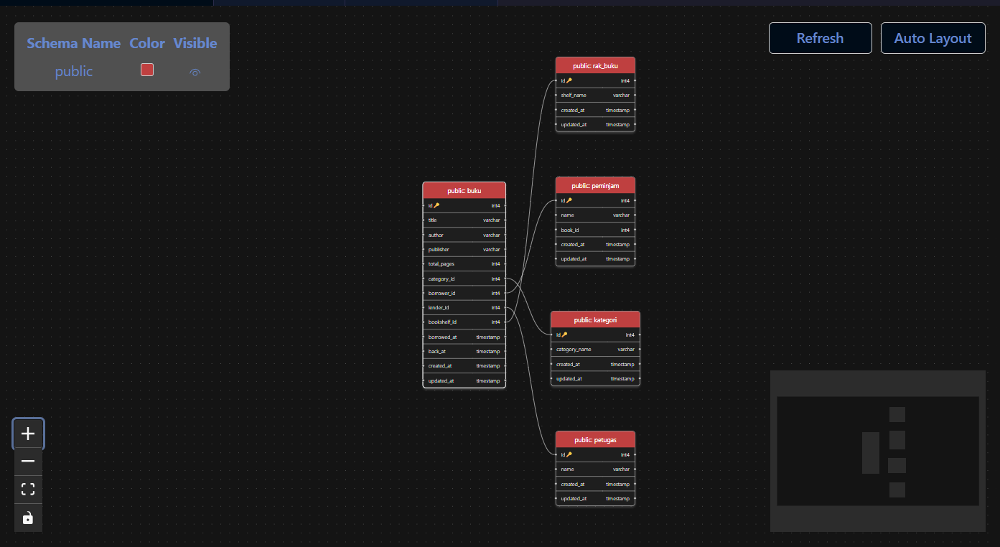
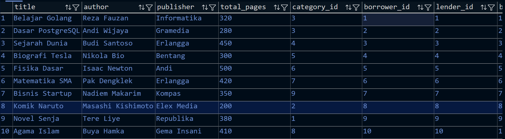
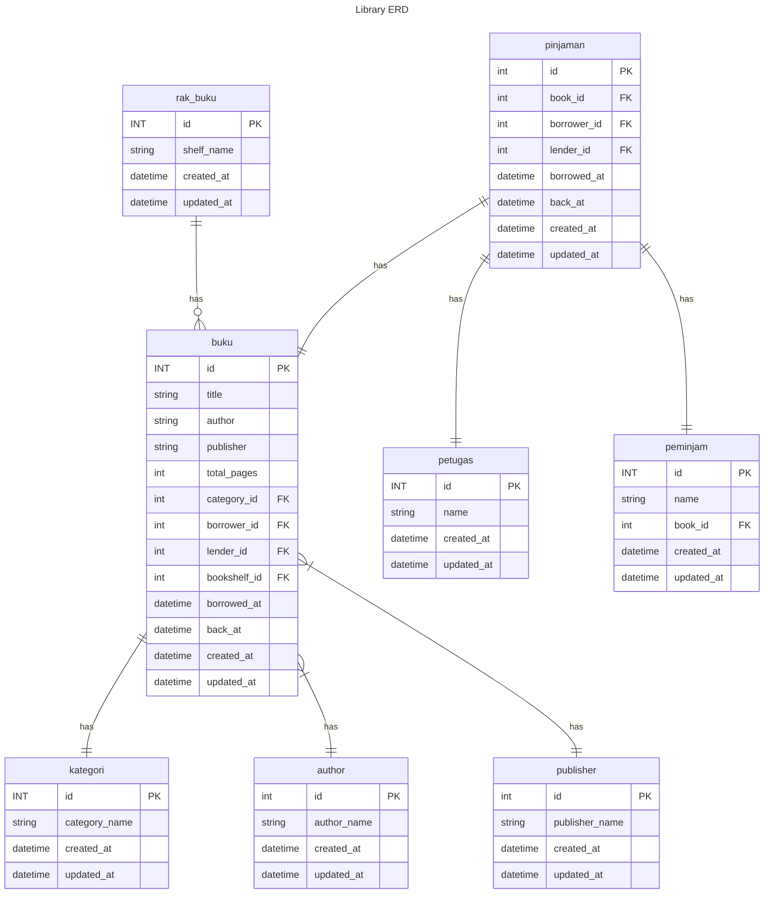

# Entity Relationship Diagram : Library ERD
Creating ERD and implement it to postgreSQL database

## Result Screenshoot

## Data Screenshoot

## How to run it 
- Download base.sql run it with postgresql query terminal

